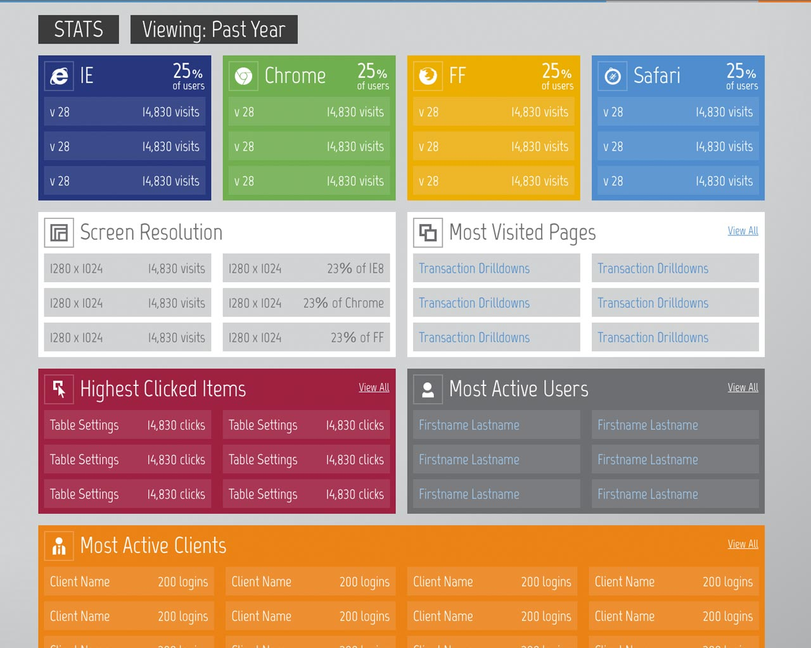
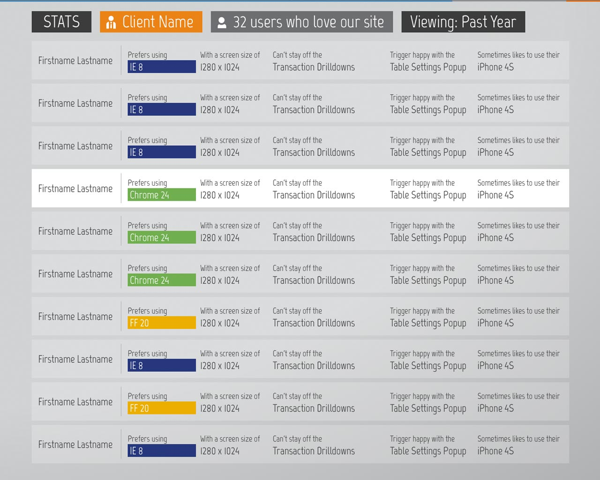

<h1><a href="http://www.chathamfinancial.com" target="_blank">Chatham Financial's</a> user analytics UI</h1>

1st Quarter 2013 | Hack Week Project

<h3>Contributors</h3>
<a href="http://www.twitter.com/bwhitham" target="_blank">@bwhitham</a>
<a href="http://www.twitter.com/sourdoughdetzel" target="_blank">@sourdoughdetzel</a>

Phillisk

Master KO

 

<small>
	This non-functional UI is yours to use as reference or a starting point for any projects you may have.
</small>

<small>Thanks to <a href="http://www.fffabs.com" target="_blank">Fabio Basile</a> for the browser icons via Dribble</small>